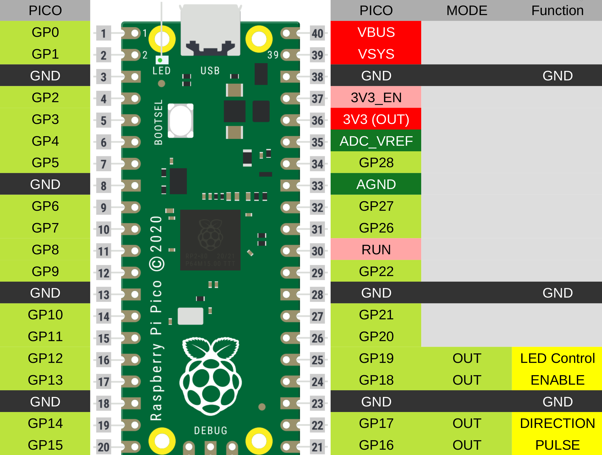

# PICO_USB2PED
Code to use Raspberry PICO as interface converter from USB-Serial to Pulse-Enable-Direction Stepper Driver and LED Control.
This is useful in DIY telecine/film scanners controlling the frame movement with an stepper motor.

