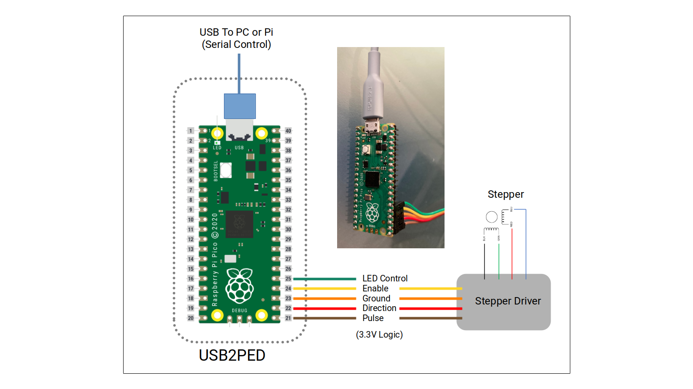

# PICO_USB2PED
Code to use Raspberry PICO as interface converter from USB-Serial to Pulse-Enable-Direction Stepper Driver and LED Control.
This is useful in DIY telecine/film scanners controlling the frame movement with an stepper motor.
Repository includes PDF with information and the file PICO_USB2PED.uf2 to flash/upload to PICO.

Follow these steps to flash the PICO:
1. Download the file PICO_USB2PED.uf2 at the flash folder in the repository.
2. Press and hold the Bootsel button (button next to the usb connector) then connect the pico to the PC (while holding it pressed). After is connected, let go of the bootsel button.
3. The pico will show in your PC or RPi as a storage device (similar to a usb-drive).
4. Copy the file PICO_USB2PED.uf2 you downloaded to the storage device. That will flash the PICO.
The storage device will then disappear, and the PICO is now programmed.

To test manually, any serial terminal can communicate with the added Serial port (PICO connected to a USB port).
Check what serial port was assigned by the PC or RPi. In the RPi it typically is assigned /dev/ttyACM0.

For the Terminal program (Putty Serial for example) use the following settings to connect:
- Port = /dev/ttyACM0 for Rapsberry or COM port for other OS.
- baudrate = 115200
- bytesize = 8
- stopbits = 1
- parity = N

Once you are able to connect via the terminal program, typing the letter-command will allow you to see/test the results on the corresponding GPIO pins.
- L - will make GP19 (Led) High.
- l - will make GP19 (Led) Low.
- E - will make GP18 (Enable) High.
- e - will make GP18 (Enable) Low.
- D - will make GP17 (Direction) High.
- d - will make GP17 (Direction) Low.
- T - will send the one-turn number of pulses out of GP16 (Pulse).
See the PICO_USBPED Documentation pdf for all the commands available, including setting the number of pulses per turn, and frequency of the pulses.

Follow the Diagram to Wire the PICO to the Stepper Driver.

